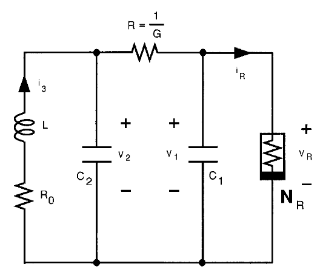
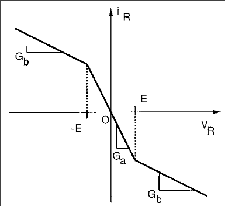

# Chua Oscillator — A Paradigm of Chaos
**References:**  
- Chua L. O., IEICE Trans. Fundamentals E76-A, 704, (1993) [pdf](https://people.eecs.berkeley.edu/~chua/papers/Chua93c.pdf)
- Galias Z., Positive Topological Entropy of Chua's Circuit: A Computer Assisted Proof. International Journal of Bifurcation and Chaos, 331-349 (1997) [pdf](https://people.eecs.berkeley.edu/~chua/papers/Galias97.pdf)
- Pivka, L., Wu, C.W., Huang, A.: Chua’s oscillator: a compendium of chaotic phenomena. J. Franklin Inst. 331, 705–741 (1994) [pdf](https://people.eecs.berkeley.edu/~chua/papers/Pivka94.pdf)

---

## Part I — Theory

### 1. Motivation and Context

- **Goal:** Understand how simple deterministic circuits can exhibit complex, aperiodic, and chaotic dynamics.  
- **Why Chua circuit?**  
  - It is the *simplest physical chaotic oscillator*.  
  - Realizable with simple electronic components.  
  - Ideal for exploring bifurcations, attractors, Lyapunov exponents, and fractal geometry.  

**Key chaotic oscillator families:**
Lorenz, Rössler, Duffing, **Chua** — each is a low-dimensional autonomous system.
Autonomous system are systems displaying time varying outputs withouth a time-varying input 

---

### 2. Circuit Description

**Components**
| Symbol | Element | Role |
|---------|----------|------|
| $C_1$ | Capacitor | voltage $v_1$ |
| $C_2$ | Capacitor | voltage $v_2$ |
| $L$  | Inductor  | current $i_3$ |
| $R$  | Resistor  | linear damping |
| $R_0$  | Resistor  | linear damping |
| $N_R$ | Nonlinear resistor (“Chua diode”) | source of nonlinearity |

---

### 3. Governing Equations

Apply Kirchhoff’s laws:
1) The sum of all currents in a node is zero
2) The sum of all potential drops within a loop is zero

| Quantity | Expression |
|-----------|---------------|
| Current | $\sum\limits_{l \in \text{Node}} i_l=0  \hspace{1cm}$    | 
| Voltage | $\sum\limits_{l \in \text{Loop}} v_l=0  \hspace{1cm}$    | 

We apply the first rule to the the two top nodes, and the second one to the loop
containing the inductor $L$, the resistor $R_0$ and the capacitor $C_2$.
Therefore getting the equations:

$$
\begin{aligned}
C_1 \frac{dv_1}{dt} &= \frac{1}{R}(v_2 - v_1) - i_{NR}(v_1), \\
C_2 \frac{dv_2}{dt} &= \frac{1}{R}(v_1 - v_2) + i_3, \\
L \frac{di_3}{dt} &= -v_2-R_0 i_3.
\end{aligned}
$$

The current $i_{NR}(v_1)$ is the current flowing through the non-linear resistor.
In general can have any form, provided it is a non-linear function of $v_1$.
The easiest form [Chua 1993] is a piecewise linear function.

$$ i_{NR}(v_1) = G_b v_1 + \frac{1}{2}(G_a - G_b)
  \big(|v_1 + E| - |v_1 - E|\big) $$

- $G_a$: inner (negative) slope  
- $G_b$: outer slope  
- $E$: break voltage  

This defines a **three-segment** $I–V$ curve.

**WARNING:** Notice the negative response of the system, the current flows "in the wrong direction". This is called negative differential resistance.

---

### 4. Normalization and Dimensionless Form

Let introduce dimensionless quantities
||||
|-----------|-----------|-----------|
|$x = \frac{v_1}{E}$ | $y = \frac{v_2}{E}$ | $z = \frac{R i_L}{E}$|
| $\alpha=\frac{C_2}{C_1}$| $\beta=\frac{R^2 C_2}{L}$| $\gamma=\frac{R R_0 C_2}{L}$|
|a=R G_a|b=R_Gb|$\tau = \frac{t}{R C_2}$|

Through which we can rewrite the set of equations as:

$$
\begin{aligned}
\frac{dx}{d\tau} &= \alpha (y - x - f(x)), \\
\frac{dy}{d\tau} &= x - y + z, \\
\frac{dz}{d\tau} &= -\beta y -\gamma z,\\
f(x) &= b x + \frac{1}{2} (a - b)(|x + 1| - |x - 1|).
\end{aligned}
$$

---

### 5. Equilibria and Linear Stability
**Fixed points**
Let us find the fixed points of this equation by setting

Set $\frac{dx}{d\tau}=0,\frac{dy}{d\tau}=0,\frac{dx}{d\tau}=0$

Hence there is the possibility of **three fixed points**:

|   Region  |  Fixed point (x,y,z) |
|-------------|-------------|
| $x < -1$ | $\left(1,\frac{\gamma}{\beta+\gamma},-\frac{\beta}{\beta+\gamma}\right) x^{-}$ |
| $  &#124; x &#124; < 1$ | $(0,0,0)$ |
| $x > 1$ | $\left(1,\frac{\gamma}{\beta+\gamma},-\frac{\beta}{\beta+\gamma}\right) x^{+}$ |

with:

$$
x^{\pm}=\pm\frac{(b-a)(\gamma+\beta)}{(\beta+b(\gamma+\beta))}.
$$

The two fixed points in the outer region $ |x|> 1 $ exist only for $\pm x^{\pm}>\pm 1$.

**Stability**
To study the stability of the fixed points we compute the Jacobian of the system:

$$
J =
\begin{pmatrix}
-\alpha(1+f'(x^*)) & \alpha & 0 \\
1 & -1 & 1 \\
0 & -\beta & -\gamma
\end{pmatrix}
$$

where $x^{&ast}$ is the x component of the fixed point $( x^*, y^*, z^*  )$ considered. 

