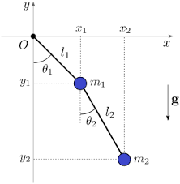

# The Double Pendulum

## 1. Introduction

The double pendulum is a simple mechanical system consisting of two pendulum arms connected in series. Despite its simplicity, its dynamics can exhibit a wide range of behaviors—from predictable oscillations to fully chaotic motion.

This makes it an ideal system to study in the context of **nonlinear dynamics**, **sensitive dependence on initial conditions**, and **chaos theory**.

This lecture provides:
- A theoretical introduction to the double pendulum
- A derivation of the equations of motion
- An explanation of chaotic vs. non-chaotic behavior
- Hands-on exercises
- A full C++ implementation for numerical integration

---

# 2. Theoretical Background

## 2.1 The double pendulum system

We consider two point masses:
- Masses: $m_1, m_2$
- Rod lengths: $L_1, L_2$
- Angles from the vertical: $\theta_1, \theta_2$

The configuration is fully described by the generalized coordinates:

$$
q = (\theta_1,\theta_2)
$$

## 2.2 Kinetic and potential energy

### Positions:
$$
x_1 = L_1 \sin\theta_1,\quad y_1 = -L_1 \cos\theta_1
$$
$$
x_2 = x_1 + L_2 \sin\theta_2,\quad y_2 = y_1 - L_2 \cos\theta_2
$$

### Velocities:
Obtain by differentiating the above expressions.

### Energies:
$$
\begin{aligned}
T &= \frac{1}{2}m_1 v_1^2 + \frac{1}{2}m_2 v_2^2, \\
V &= m_1 g y_1 + m_2 g y_2.
\end{aligned}
$$

We now make a change of variables to polar coordinates to write:

$$
\begin{aligned}
y_1&=-L_1 cos(\theta_1),\\
y_2&=-L_1 cos(\theta_1)-L_2 cos(\theta_2),\\
v_1&=L_1\dot \theta_1, \\
v_2&=\sqrt{(L_1\dot \theta_1)^2+(L_2\dot \theta_2)^2+2L_1L_2\dot\theta_1\dot\theta_2\cos(\theta_2-\theta_1)}. \\
\end{aligned}
$$

The velocity $v_2$ can be easily obtained by first computing it in the reference frame co-moving with the mass $m_1$ and then going back to the rest frame:

$$
\begin{aligned}
\tilde{\bf v}_2& = L_2\dot\theta_2\hat{\mathbf \theta}_2, \\
{\bf v}_2 &=\tilde{\bf v}_2+L_1\dot\theta_1\hat{\mathbf \theta}_1, \\  
\end{aligned}
$$

where $\hat{\mathbf \theta}_1$ and $\hat{\mathbf \theta}_2$ are the tangent vectors to the trajectories of the mass m_1 and m_2 in the rest and $m_1$ reference frame respectively.

### Lagrangian:

We can now write the Lagrangian which is given by:

$$
\begin{aligned}
\mathcal{L} &= T - V\\
&=\frac{1}{2}m_1(L_1\dot \theta_1)^2+\frac{1}{2}m_2\left((L_1\dot \theta_1)^2+(L_2\dot \theta_2)^2+2L_1L_2\dot\theta_1\dot\theta_2\cos(\theta_2-\theta_1)\right)\\
&m_1 g L_1 cos(\theta_1)+m_2 g (L_1 cos(\theta_1)+L_2 cos(\theta_2)). 
\end{aligned}
$$

---

## 2.3 Equations of Motion

Using the Euler–Lagrange equations:

$$
\frac{d}{dt}\left(\frac{\partial \mathcal{L}}{\partial \dot\theta_i}\right) - \frac{\partial \mathcal{L}}{\partial \theta_i} = 0
$$

We obtain the two equations:

$$
\begin{aligned}
(m_1+m_2)L_1 \ddot\theta_1+m_2L_2\ddot\theta_2\cos(\theta_2-\theta_1)&=m_2L_2\dot\theta_2^2\sin(\theta_2-\theta_1)-(m_1+m_2)g\sin(\theta_1)\\
L_2 \ddot \theta_2+L_1\ddot \theta_1\cos(\theta_2-\theta_1)&=-L_1\dot\theta_1^2\sin(\theta_2-\theta_1)-g\sin(\theta_2),
\end{aligned}
$$

which can be used to derive the following equations:

<!--$$ \ddot{\theta}_1 = 
\frac{-g(2m_1+m_2)\sin\theta_1 - m_2 g\sin(\theta_1 - 2\theta_2)- 2\sin(\theta_1 - \theta_2)m_2\left( \dot\theta_2^2 L_2 + \dot\theta_1^2 L_1 \cos(\theta_1 - \theta_2 )\right)}
 {L_1\left(2m_1 + m_2 - m_2\cos(2\theta_1 - 2\theta_2)\right)} $$

$$ \ddot{\theta}_2 =
\frac{2\sin(\theta_1 - \theta_2)}{L_2}\left[
\dot\theta_1^2 L_1(m_1+m_2) + g(m_1+m_2)\cos\theta_1-\dot\theta_2^2 L_2 m_2 \cos(\theta_1 - \theta_2)
\right]
\bigg/
\left(2m_1 + m_2 - m_2\cos(2\theta_1 - 2\theta_2)\right)$$
-->
This nonlinear, coupled system shows chaotic behavior at sufficiently high energy.

---

# 3. Chaos in the Double Pendulum

## 3.1 Sensitive Dependence on Initial Conditions

A hallmark of chaos:
- Tiny perturbations in initial angles/velocities lead to very different trajectories.
- At small amplitude, the motion is regular and nearly periodic.
- At high energy, the second arm can rotate fully, triggering chaotic dynamics.

## 3.2 Phase space structure

The system has:
- Regular, smooth trajectories at low energy
- Fractal-like separatrices at moderate energy
- Fully chaotic regions at high energy

This provides a natural way to study the transition between order and chaos.

---

# 4. Numerical Integration

We rewrite the system as first-order ODEs:

$$
\dot\theta_1 = \omega_1,\quad \dot\theta_2 = \omega_2
$$
$$
\dot\omega_1 = f_1(\theta_1,\theta_2,\omega_1,\omega_2)
$$
$$
\dot\omega_2 = f_2(\theta_1,\theta_2,\omega_1,\omega_2)
$$

A 4th-order Runge–Kutta integrator is used.

---

